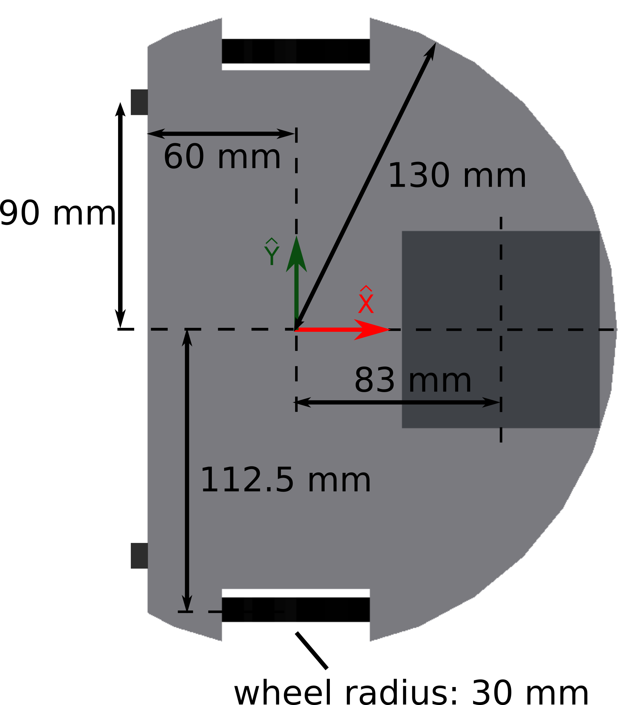
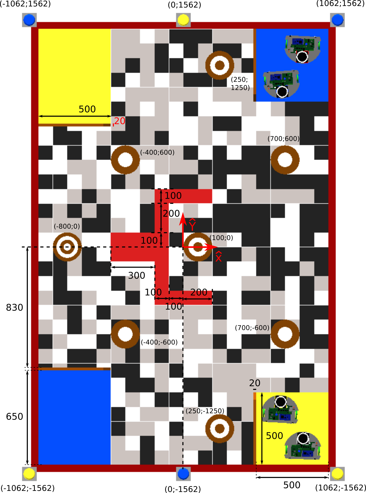
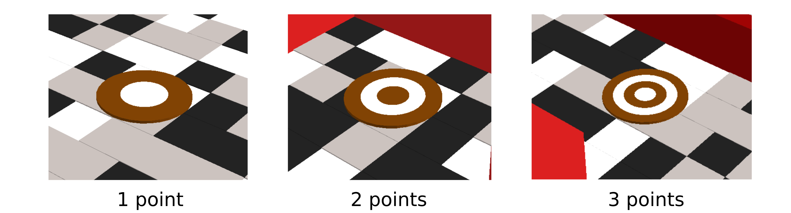
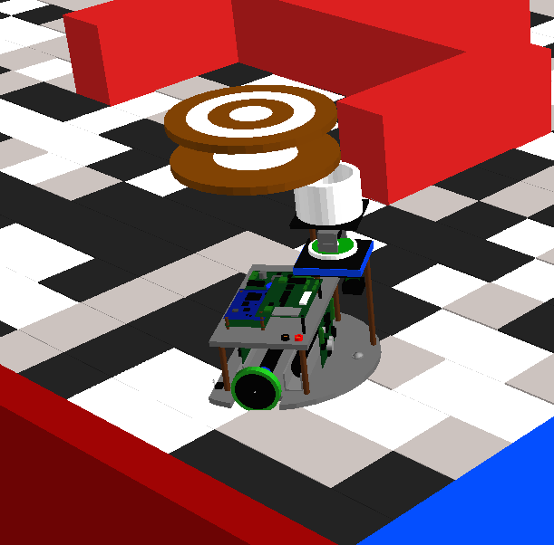
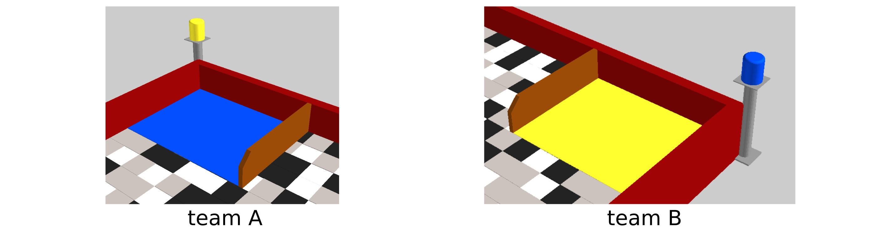
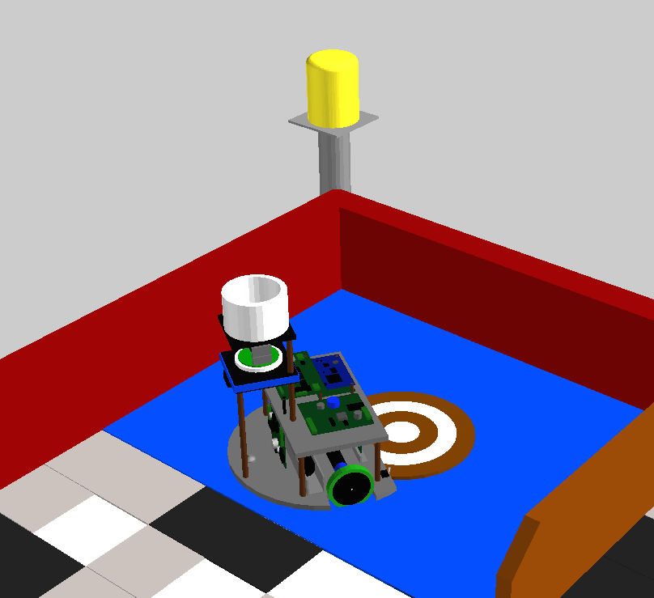
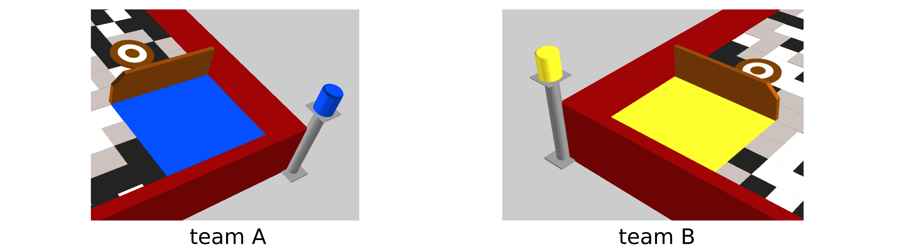
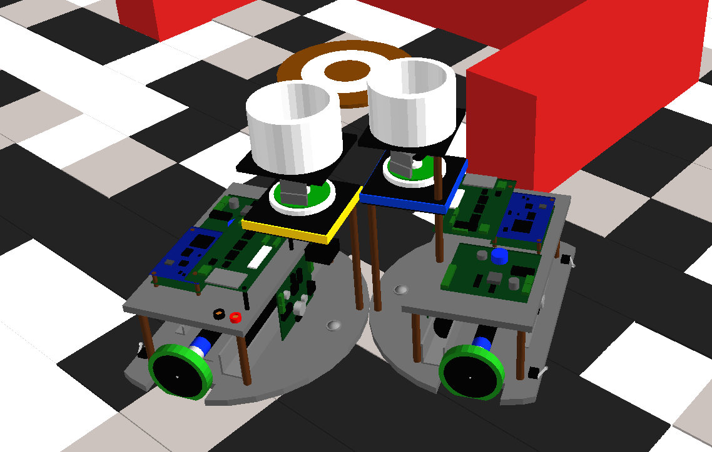
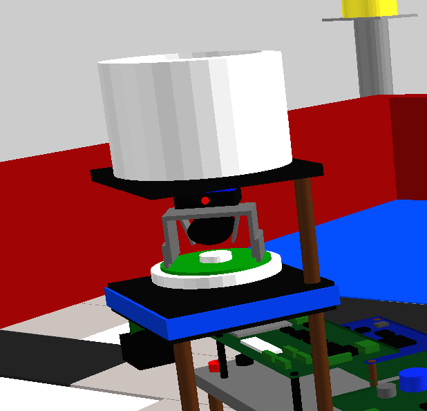
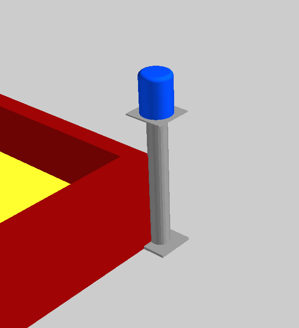

Project specific features
-------------------------

This project is a simulator reproducing the main features of the [Eurobot](http://www.eurobot.org/) competitions, which are robotics contests. 
The objective is to be able to implement efficient controllers for the robots and to test them. 
To this end, inputs are simulated and transferred to the controllers, which must then provide the appropriate outputs.

This project is part of the UCL [LMECA2732 course](http://moodleucl.uclouvain.be/course/view.php?id=5143) (Robotics) and presents a 90 seconds match. Robots must be able to score points during the match, while avoiding interactions with the robots from the other team. 
The final score of each team is automatically computed at the end of the game and the winner is presented. 
Apart from the score management and the sensors simulation, other features of this project involve: contact model computation, moving objects management, penalties detection, DC motors simulation...

[](https://www.youtube.com/watch?v=DODtoFsPtoA)


Robots and map
--------------

__Robots__

The robots are differential-wheeled robots. They have DC motors to control their respective wheels. On top of their main structure, a tower is rotating with sensors attached on it to detect beacons on the field and the competing robot.

For their main sensor inputs, they have access to odometers to get the wheel velocities, to one absolute encoder to get the tower absolute position, to one sensor detecting beacons, to one color sensor, and to two micro-switches in the back of the robot able to detect a contact on a very short range.
This is a presentation of a robot dimensions, along with its sensors position:



<br/>

The origin of the robot (point to consider when talking about its position) is located at the centre of the robot local frame. The tower is located 83 mm in front of it. On top of this tower, there is a beacon (radius of 40 mm) used by the opponent to detect the robot position. The wheels (radius of 30 mm) are separated by an axle whose length is 225 mm. Two micro-switches are located on the rear side of the robot. They are depicted by small grey rectangles and have a range of 5 mm. They can also be seen on the bottom of the following robot picture:


__Map__

The map is presented below, its frame being located at the centre. All measures are expressed in mm. All obstacle lengths are presented, together with the targets initial positions and the fixed beacon positions (their coordinates are expressed in the map frame). Regarding the fixed beacons, they have a radius of 40 mm, as the ones on top of the robots. On this map, when a length or position is not presented, it means that it can be deduced from the map symmetry, or from its alignment with the origin. Finally, the size of the map is *2000x3000* (*2000 mm* along the *X* axis and *3000 mm* along the *Y* axis).

<br/>




Scoring points
--------------

The main objective during the match is to get the highest score thanks to targets to pick, to carry and to release in the team basis. On the map, there are different targets whose initial position is known (see section __Map__). Each target is worth a certain amount of points, as presented below:



<br/>

To pick a target, a robot must stop on top of it. This means that the vertical projection of its origin (i.e. the origin of the robot frame depicted above with the robot dimensions, in the section __Robots__) must be inside the circle delimiting the target. If a robot maintains this position during *1.5 s*, the target is automatically grabbed. In simulation, to detect if a target lays under the robot, you can use the `target_detected` input (see __Inputs__ section). Each robot can carry up to two targets simultaneously, as can be seen in the next picture:

<br/>



<br/>

To get the points, the target must be released in the team basis. The team bases are depicted in the next figure.

<br/>



<br/>

A target is considered to be inside a target basis (i.e. collecting area), provided it *entirely* lays in the corresponding rectangle. Once a target meets this condition, points are granted to the corresponding team. This target cannot be removed from the basis. In the following picture, the yellow robot managed to release its target in its basis.

<br/>




Match penalties
---------------

__Not in basis at beginning__

Each robot receives a time input `t` (see the __Inputs__ section). This time runs from *-15 s* to *115 s*. During the first 15 seconds, robots can move as they want. Because their initial position is not perfectly known (this can be adapted in [config_file.txt](userFiles/config/config_file.txt), see section __config_file.txt__), this time should be used to calibrate the robot. During the last *0.1 s* of the calibration time (i.e. with *t* in the range *[-0.1 ; 0.0] s*), all robots must be in their initial bases depicted below. Each team which is not fulfilling this condition receives a penalty of 10 points. The corresponding team initial bases are depicted below.

<br/>



<br/>

__Out of time__

The game lasts 90 seconds. It is forbidden for the robots to move after the gaming time (i.e. when the input `t` is more than *90 s*). Otherwise, a penalty of *10 points* is given to the corresponding team.

<br/>

__Contact with opponent__

Contacts are prohibited between robots from different teams. If a contact occurs, a penalty of 3 points is given to the team with the fastest impacting robot. 
After such a contact, no additional contact penalty is given during the next 10 seconds. 
If two robots are in contact with the same object, it is not considered as a forbidden contact.

<br/>




Controller design
-----------------

Each team of student must design a controller which can work for any of the four robots (two teams of one or two robots).
This controller must be able to control a single robot in a team where only one robot is competing.
However, you must be able to face a team of one or two robots (or to grab points when there is no opponent).
If a robot does not take part in the game, it is removed from the map.

Each team of students designs its controller in the folder *grX* (where X is your group number) located [here](userFiles/ctrl/groups_ctrl).
At the end, you will only provide the folder *grX* of your group. Consequently, if you modify the simulation environment, your controller might not work properly when corrected.

Because your controller will also be tested on real robots running *C* code, you must program in *C*. However, you will do this *C* programming in *C++* files (i.e. files with *.cc* or *.cpp* extension).

The reason is the following: at the end of the project, we will gather the results of all groups in a single program. Consequently, if different groups choose common names for their functions or files, this might be an issue during compilation. To solve this problem, we will use *namespace* techniques, which are unfortunately only available in *C++*. However, you can program in *C++* files using *C* code.

In each *grX* controller, four files are already provided (see [here](userFiles/ctrl/groups_ctrl/gr1) for example with group 1):
* [ctrl_main_grX.cc](userFiles/ctrl/groups_ctrl/gr1/ctrl_main_gr1.cc): the main entrance of your controller: `controller_init` is called once when starting the controller, `controller_loop` is called every time step (corresponding to *1 ms*) and `controller_finish` is called when your controller is shutting down. Each of these three functions receive the same input `CtrlStruct *cvs`, which is detailed later (see *CtrlStruct_grX.cc*). 
* [ctrl_main_grX.h](userFiles/ctrl/groups_ctrl/gr1/ctrl_main_gr1.h): the header corresponding to `ctrl_main_grX.cc`.
* [CtrlStruct_grX.cc](userFiles/ctrl/groups_ctrl/gr1/CtrlStruct_gr1.cc): the structure `CtrlStruct` (defined in *CtrlStruct_grX.h*) is always provided to your basic functions. It contains two fields which cannot be removed: `CtrlIn *inputs` (the inputs of the controller) and `CtrlOut *outputs` (the outputs of the controller). These two fields are detailed later. You can add any variable or structure to `CtrlStruct`. This is especially useful to save variables during the different controller calls. The function `init_CtrlStruct` is called once before `controller_init` and the function `free_CtrlStruct` is called once after `controller_finish`.
* [CtrlStruct_grX.h](userFiles/ctrl/groups_ctrl/gr1/CtrlStruct_gr1.h): the header corresponding to `CtrlStruct_grX.cc`.

You can increment these four files, but you cannot suppress functions or fields already defined because the controller would become incompatible with the interface build on top of it.

On top of that, you may add as many files as you want, provided you put them inside your [grX](userFiles/ctrl/groups_ctrl) folder. You can also add subdirectories inside your *grX* folder. Each time you add or you suppress a file, you must run [CMake](https://cmake.org/) again (see [Robotran](http://www.robotran.be/) tutorials). To add a source file, you must add it as a *C++* file with the following extension: `_grX.cc`. The `.cc` ensures that this file is compiled as a *C++* file, while the `_grX` part (where `X` should be replaced by the number of your group) is there to ensure that there will be no file name collisions when gathering the controllers from all groups. In a similar way, when you add a header file, its name must end with `_grX.h`.

Then, copy these lines inside each new source file (`filename_grX.cc`):

```
/*! 
 * \file filename_grX.cc
 * \brief File description
 */
#include "namespace_ctrl.h"
#include "my_own_headers.h" // adapt it with your headers

NAMESPACE_INIT(ctrlGrX); // where X should be replaced by your group number

// add your extra code (functions, macros...) here

NAMESPACE_CLOSE();

```

All headers must be defined before `NAMESPACE_INIT(ctrlGrX);`, all the other parts of the code must be written between `NAMESPACE_INIT(ctrlGrX);` and `NAMESPACE_CLOSE();`.

In a similar way, copy this code for each new header file (`filename_grX.h`):

```
/*! 
 * \file filename_grX.h
 * \brief File description
 */
#ifndef _FILENAME_GRX_H_ // adapt it with the name of this file (header guard)
#define _FILENAME_GRX_H_ // must be the same name as the line before

#include "namespace_ctrl.h"
#include "my_own_headers.h" // adapt it with your headers

NAMESPACE_INIT(ctrlGrX); // where X should be replaced by your group number

// add your extra code (prototypes, macros...) here

NAMESPACE_CLOSE();

#endif // end of header guard

```


__Example controller__

To help you designing a controller, an example is provided in the [example_ctrl](userFiles/ctrl/example_ctrl) folder. In this example, a code structure is provided. Read carefully the files and try to understand this example. You can even take the exact same structure in your own code (if you want to) in order to extend it. It is not compulsory, but we advise the groups who feel less confident in *C* programming to do it (others can still do it if they want).

If you decide to take the same structure, first remove the files `ctrl_main_grX.cc`, `ctrl_main_grX.h`, `CtrlStruct_grX.cc` and `CtrlStruct_grX.h` from your *grX* folder (located inside the [groups_ctrl](userFiles/ctrl/groups_ctrl) folder). Then, copy all the folders and files in [example_ctrl](userFiles/ctrl/example_ctrl) and paste them in your *grX* folder. Next step is to rename all the files by replacing the `_ex.cc` and `_ex.h` file names by `_grX.cc` and `_grX.h` (where `X` should be replaced by your group number). Then, open all the files and adapt the header includes, i.e. change `#include "YYYYY_ex.h"` by `#include "YYYYY_grX.h"`. Change all the `NAMESPACE_INIT(ctrlEx);` by `NAMESPACE_INIT(ctrlGrX);`. Finally, in the headers, adapt the header guards, i.e. change `#ifndef _YYYYY_EX_H_` and `#define _YYYYY_EX_H_` by `#ifndef _YYYYY_GRX_H_` and `#define _YYYYY_GRX_H_`.


__Inputs__

All the inputs of the controller are automatically filled in the structure `inputs` of `CtrlStruct *cvs` (see [here](userFiles/ctrl/groups_ctrl/gr1/CtrlStruct_gr1.h)). This `inputs` structure is fully defined in [ctrl_io.h](userFiles/ctrl/ctrl_interface/ctrl_io.h). Read carefully this file. You can for instance get the game time with the following code (we do not show the `NAMESPACE_INIT` and the `NAMESPACE_CLOSE`, but do not forget them):

```
#include "ctrl_io.h"

void my_function(CtrlStruct *cvs)
{
	CtrlIn *ivs;
	ivs = cvs->inputs;

	printf("game time: %f", ivs->t);
}
```

Because they are automatically filled by the simulator, you just have to read them. Among these inputs, the ones related to the wheel velocities (`r_wheel_speed` and `l_wheel_speed`) and the ones related to the beacons detection (`last_rising`, `last_falling`, `last_rising_fixed` and `last_falling_fixed`) are noisy. You can adapt the noise level in [config_file.txt](userFiles/config/config_file.txt). This noise will be set to its initial value when evaluating your project.

To detect beacons, the robots can use their rotating tower, which can be seen on the following picture. On top of it, a beacon is located, which can only be seen by the opponent robots (corresponding inputs: `last_rising`, `last_falling`, `rising_index`, `falling_index`, `nb_rising` and `nb_falling`).

<br/>



<br/>

On top of that, three fixed beacons are located outside the game map for each team. They can be used to find the robot position with triangulation techniques (corresponding inputs: `last_rising_fixed`, `last_falling_fixed`, `rising_index_fixed`, `falling_index_fixed`, `nb_rising_fixed` and `nb_falling_fixed`). The colour of their basis corresponds to the colour of the corresponding team (in the next picture, the orange colour indicates that it can only be detected by the team B).

<br/>



<br/>

Among these input fields, some of them are between `#ifdef SIMU_PROJECT` and `#endif`. This means that they are only available in simulation, and not on the real robot (see later).

__Outputs__

All the outputs of the controller are located in the `outputs` structure of `CtrlStruct *cvs` (see [here](userFiles/ctrl/groups_ctrl/gr1/CtrlStruct_gr1.h)). Like `inputs`, this `outputs` structure is fully defined in [ctrl_io.h](userFiles/ctrl/ctrl_interface/ctrl_io.h). Read carefully this file. You can for instance set the tower command with the following code (do not forget the `NAMESPACE_INIT` and the `NAMESPACE_CLOSE`):

```
#include "ctrl_io.h"

void my_function(CtrlStruct *cvs)
{
	CtrlOut *ovs;
	ovs = cvs->outputs;

	ovs->tower_command = 10.0;
}
```

Similarly to some `inputs` structure fields, the field `flag_release` is defined between `#ifdef SIMU_PROJECT` and `#endif`, and is thus only available in simulation.

Noise is added on the wheel motors. A proper regulation is then needed to solve this issue. Like the noise of the inputs, its level can be adapted during the controller developments [here](userFiles/config/config_file.txt).

A very basic controller example is provided in this [folder](userFiles/ctrl/example_ctrl).


__config_file.txt__

A special configuration file called *config_file.txt* can be found [here](userFiles/config/config_file.txt). This file is mainly used by the teaching staff to design the game. However, some fields can still be adapted by the students during their controller developments. All necessary information is provided in this document.

In particular, you can define the controllers to attribute to each of the four robots (or remove a robot from the game by assigning the controller `NoCtrl`). Therefore, a good start to design the controller is to work only with one robot (robot alone on the game map). This can be achieved with the following configuration:

```
blue_ctrl   : GrXCtrl
red_ctrl    : NoCtrl
yellow_ctrl : NoCtrl
white_ctrl  : NoCtrl
```

where the `X` in `GrXCtrl` should be replaced by the number of the group.

You can also adapt the level noise, but keep in mind that when your controllers will be tested, [config_file.txt](userFiles/config/config_file.txt) will be set to its initial form (except for the choice of the robot controllers). This means that your controller will be evaluated with the initial noise.

A hardcoded version (i.e. without *.txt* reading) is provided in [config_file.h](userFiles/config/config_file.h) and [config_file.cc](userFiles/config/config_file.cc)). This hardcoded version can be used by uncommenting `#define HARDCODED_CONFIG` in [config_file.h](userFiles/config/config_file.h). This is especially useful for students facing difficulties reading the [config_file.txt](userFiles/config/config_file.txt) file. Pay attention to the errors when running the simulation.


__Match results__

During the game, the score evolution is printed. Ten seconds after the end of the game, the winner is printed. Pay attention that your grade will not be proportional to the score you get ! 


__Analysing the results__

To analyse the results during the game, you can simply use the `printf` function on your controller variables or on the ones related to the simulation. To get information from the simulation, the easiest way is to open the [user_dirdyn.c](userfctR/user_dirdyn.c) file and to add your `printf` in the `user_dirdyn_loop` function, which is called at each time step. The kinematics can be easily accessed with `mbs_data->q[]` (joint positions [rad] or [m]), `mbs_data->qd[]` (joint velocities [rad/s] or [m/s]) and `mbs_data->qdd[]` (joint accelerations [rad/s^2 ] or [m/s^2 ]). The corresponding indexes to put inside the brackets are available in [user_all_id.h](userfctR/user_all_id.h). In a similar way, the indexes related to the robots and the teams are available in [robot_id.h](userFiles/simu/cpp_interface/robot_id.h).


For instance, the position and orientation of the blue robot can be printed using the following line (useful to test the odometry developments).

```
printf("x:%f [m] ; y:%f [m] ; angle:%f [deg]\n", mbs_data->q[FJ_T1_robot_B_id],
	mbs_data->q[FJ_T2_robot_B_id], mbs_data->q[FJ_R3_robot_B_id]*RAD_TO_DEG);
```

To visualize the curves evolution in real-time, you can use the `set_plot` function. This function needs to include the header *user_realtime.h*: (`#include "user_realtime.h"`). This function can be used in your controller or in any *Robotran* file (like [user_dirdyn.c](userfctR/user_dirdyn.c)). The prototype of this function is `void set_plot(double value, char* label)`, where `value` is the signal to analyse and `label` is its legend (caution: all signals must have different legends !). More information is available on the *Robotran* tutorials.

Here is a similar example using `set_plot`:

```
#include "user_realtime.h"

set_plot(mbs_data->q[FJ_T1_robot_B_id], "x [m]");
set_plot(mbs_data->q[FJ_T2_robot_B_id], "y [m]");
set_plot(mbs_data->q[FJ_R3_robot_B_id], "angle [rad]");
```

Very similar to the `set_plot` function, the prototype of the `set_output` function is the following: `void set_output(double value, char* label)`. This function is used to generate result files (*.res*) in the [resultsR](resultsR) folder. The signals are saved as `label.res` where `label` is the label given in `set_output` (avoid spaces). The first column is the time reference (starting at *0 s*, not at *-15 s*), the second one is the temporal evolution of the signal `value`.

This *.res* files can then easily be opened with [Matlab](http://nl.mathworks.com/index.html?s_tid=gn_logo), or any other program. It is then possible to extract graphs to include in the final report (better than putting print screens of the real-time graphs). Another possibility is to use a python script. An example is provided in the [analyze.py](resultsR/analyze.py) file.

To use this function, you must first open [main.cc](workR/src/main.cc) and set `mbs_dirdyn->options->save2file` to `1`. It is also necessary to add `#include "set_output.h"`. Here is an example:

```
#include "set_output.h"

set_output(mbs_data->q[FJ_T1_robot_B_id], "x");
set_output(mbs_data->q[FJ_T2_robot_B_id], "y");
set_output(mbs_data->q[FJ_R3_robot_B_id], "angle");
```


__FSM design__

During your controller design, you might have to write several *Finite State Machines* (*FSM*). A FSM is a mathematical model of computation with a finite number of states. This is especially relevant for the strategy design. There are different ways to implement a FSM in *C*. Here is a possibility:

```
enum {STATE_1, STATE_2, STATE_3, NB_STATES}; // replace 'STATE_X' by a more explicit name

switch (cvs->state) // cvs->state is a state stored in the controller main structure
{
	case STATE_1:
		// actions related to state 1

		if (/* condition to go to state 2*/)
		{
			cvs->state = STATE_2;
		}
		break;

	case STATE_2:
		// actions related to state 2

		if (/* condition to go back to state 1*/)
		{
			cvs->state = STATE_1;
		}
		else if (/* condition to go to state 3*/)
		{
			cvs->state = STATE_3;
		}
		break;

	case STATE_3:
		// actions related to state 3
		break;

	default:
		printf("Error: unknown state : %d !\n", cvs->state);
		exit(EXIT_FAILURE);
}

```


__Memory allocation in structures__

During the project, you will have to create structures, to allocate memory and to release this memory. This is particularly used with the `CtrlStruct *cvs` structure. Here is a simple example where different sub-structures are allocated (and released) inside the main `CtrlStruct` structure. Examples are also provided for a simple variable and for different tabulars.

```
#include <stdlib.h>
#include <stdio.h>

// forward declaration (do not pay attention)
typedef struct CtrlIn CtrlIn;
typedef struct CtrlOut CtrlOut;

// size of the tabulars
#define TAB_1D_SIZE  10 ///< size of the 1D tabular
#define TAB_2D_SIZE_A 6 ///<  first size of the 2D tabular (i.e. number of lines)
#define TAB_2D_SIZE_B 5 ///< second size of the 2D tabular (i.e. number of columns)

/// first structure declaration
typedef struct StructOne
{
	double my_var;  ///< simple variable
	double *tab_1D; ///< 1D tabular of double

} StructOne;

/// second structure declaration
typedef struct StructTwo
{
	int **tab_2D; ///< 2D tabular of integer

} StructTwo;

/// Main controller structure
typedef struct CtrlStruct
{
	CtrlIn  *inputs;  ///< controller inputs
	CtrlOut *outputs; ///< controller outputs

	StructOne *struct_one; ///< structure one (should be defined before)
	StructTwo *struct_two; ///< structure two (should be defined before)

} CtrlStruct;

/*! \brief initialize the controller structure
 * 
 * \param[in] inputs inputs of the controller
 * \param[in] outputs outputs of the controller
 * \return controller main structure
 */
CtrlStruct* init_CtrlStruct(CtrlIn *inputs, CtrlOut *outputs)
{
	// variables declaration
	int i, j;
	CtrlStruct *cvs;

	// main structure allocation
	cvs = (CtrlStruct*) malloc(sizeof(CtrlStruct));

	// inputs and outputs
	cvs->inputs  = inputs;
	cvs->outputs = outputs;

	// Structure One
	cvs->struct_one = (StructOne*) malloc(sizeof(StructOne));

	cvs->struct_one->my_var = 1.618;

	cvs->struct_one->tab_1D = (double*) malloc(TAB_1D_SIZE*sizeof(double));

	for(i=0; i<TAB_1D_SIZE; i++)
	{
		cvs->struct_one->tab_1D[i] = i*i;
	}

	// Structure Two
	cvs->struct_two = (StructTwo*) malloc(sizeof(StructTwo));

	cvs->struct_two->tab_2D = (int**) malloc(TAB_2D_SIZE_A*sizeof(int*));

	for(i=0; i<TAB_2D_SIZE_A; i++)
	{
		cvs->struct_two->tab_2D[i] = (int*) malloc(TAB_2D_SIZE_B*sizeof(int));

		for(j=0; j<TAB_2D_SIZE_B; j++)
		{
			cvs->struct_two->tab_2D[i][j] = i+j;
		}
	}

	// return initialized main structure
	return cvs;
}

/*! \brief release controller main structure memory
 * 
 * \param[in] cvs controller main structure
 */
void free_CtrlStruct(CtrlStruct *cvs)
{
	// variable declaration
	int i;

	// Structure One
	free(cvs->struct_one->tab_1D);
	free(cvs->struct_one);

	// Structure Two
	for(i=0; i<TAB_2D_SIZE_A; i++)
	{
		free(cvs->struct_two->tab_2D[i]);
	}
	free(cvs->struct_two->tab_2D);
	free(cvs->struct_two);

	// main structure
	free(cvs);
}

/*! \brief main function
 */
int main(int argc, char const *argv[])
{
	// variables declaration
	int i, j;
	double *tab_1D; ///< pointer to the 1D tabular
	int **tab_2D;   ///< pointer to the 2D tabular
	CtrlStruct *cvs; ///< controller main structure

	// initialize the controller main structure
	cvs = init_CtrlStruct(NULL, NULL);

	// pointers to the tabulars (already created before)
	tab_1D = cvs->struct_one->tab_1D;
	tab_2D = cvs->struct_two->tab_2D;

	// Structure One
	printf("golden ratio: %f\n\n", cvs->struct_one->my_var);
	for(i=0; i<TAB_1D_SIZE; i++)
	{
		printf("%d: %f\n", i, tab_1D[i]);
	}
	printf("\n");

	// Structure Two
	for(i=0; i<TAB_2D_SIZE_A; i++)
	{
		for(j=0; j<TAB_2D_SIZE_B; j++)
		{
			printf(" %d ", tab_2D[i][j]);
		}
		printf("\n");
	}

	// release memory
	free_CtrlStruct(cvs);

	// end of main
	return 0;
}
```

If you want to test this simple code (compile and run), you can simply use the following lines on Unix, in the Terminal (first, copy the code in a file called `main.c`):

```
gcc main.c -o exe
./exe
```

During your developments, you might face segmentation faults problems. Debugging it without tools is not an easy task. On *Windows*, you can use the [Visual Studio Debugger](https://msdn.microsoft.com/en-us/library/sc65sadd.aspx), while on Unix (*Mac OS* or *Linux*), you can use [gdb](https://www.gnu.org/software/gdb/) or [cgdb](https://cgdb.github.io/). Other debuggers exist of course. On *Unix*, you can also use tools like [valgrind](http://valgrind.org/) to check memory leak.

Importantly, to use all these aforementioned tools, you must deactivate the real-time features. This is done in the [main.cc](workR/src/main.cc) file, by changing the line `mbs_dirdyn->options->realtime = 1;` to `mbs_dirdyn->options->realtime = 0;`.


__Porting the controller to a real robot__


Before sending your controller to the real robot, it is important to check that the code is compatible with *C*. Normaly, if you did not use specific *C++* features during the project developments, this should be quite straightforward.

To test your code compatibility, you can use the [codeC](codeC) folder. First thing to do is to open the [main file](codeC/src/generic/main.c) of this project and to replace the `X` by your group number in the two following lines:


```
#include "CtrlStruct_grX.h"
#include "ctrl_main_grX.h"
```

Then, you must place all your controller files (i.e. the ones to provide at the end of the project, in the *grX* folder) in the folder called [specific](codeC/src/specific). All files with extension *.cc* (or *.cpp*) must be renamed with extension *.c* (transform *C++* files into *C* files). If you are on a *Unix* system (*Linux* or *Mac OS*), you can use (and adpat it if needed) the script [code_gen](codeC/code_gen).

This can be done with the following lines:


```
cd codeC
./code_gen grX
```

In the last line, you should replace `X` by the number of your group. `controller ready` should then appear!

Then, use the following commands (if you are not on a *Unix* system, you can use *CMake* as you did for the simulation project):

```
mkdir build
cd build
cmake ..
make
./exec
```

`Code running fine in C !` should appear. This means that your code is *C* compatible. If it is not the case, the warnings and/or errors (mainly at compilation) soulhd help you solve this incompatibility.

For the students taking part in the *Eurobot* competition, you should be able to reproduce the simulator interface on your MiniBot, in order to directly test your code on it. For the other students, you will have to contact the teaching staff when this test is successful. The functions `set_plot` in your code will have no effect on the real robot, but the `set_output` functions will produce the same kinds of results, this time on the real robot (for students not taking part in the *Eurobot* competition).

In [ctrl_io.h](userFiles/ctrl/ctrl_interface/ctrl_io.h), you could see that some fields were written between `#ifdef SIMU_PROJECT` and `#endif`. This means that they are only available in simulation, not on the real robot.

To solve this issue, the first thing to do is to add a new header file called `simu_game_grX.h` in your *grX* folder (in the header name, replace `X` by your group number). Then, add the following lines in this `simu_game_grX.h` file (as usual, replace `X` by your group number):

```
/*! 
 * \author group X
 * \file simu_game_grX.h
 * \brief choose between controller for simulation game or for the real robot
 */

#ifndef _SIMU_GAME_GRX_H_
#define _SIMU_GAME_GRX_H_

#include "namespace_ctrl.h"

NAMESPACE_INIT(ctrlGrX);

#ifdef SIMU_PROJECT
	#define SIMU_GAME // comment this line to see in simulation the controller which will be tested on the real robot
#endif

NAMESPACE_CLOSE();

#endif
```

Then, at the places were you use them in your code, you should use the following lines (you also need to add `#include "simu_game_grX.h"`):


```
#ifdef SIMU_GAME

// some code only compiled for simulation

#endif
```

If you have to write a bit of code only for the real robot, you can use the following lines:

```
#ifndef SIMU_GAME

// some code only compiled on the real robot

#endif
```

Finally, if you must choose between two parts of codes to compile, depending on which platform you are working on (computer in simulation or real robot), you can use the following lines:

```
#ifdef SIMU_GAME

// some code only compiled for simulation

#else

// some code only compiled on the real robot

#endif
```

To see how your real robot will react using your controller, you can simply comment the line `#define SIMU_GAME` in `simu_game_grX.h` and test it in simulation. You should fulfil the two following conditions before testing the controller on the real robot:
* In simulation, when `#define SIMU_GAME` is commented, you should see the behaviour you expect to see on the real robot
* The line `Code running fine in C !` should be printed when running the project in [codeC](codeC).